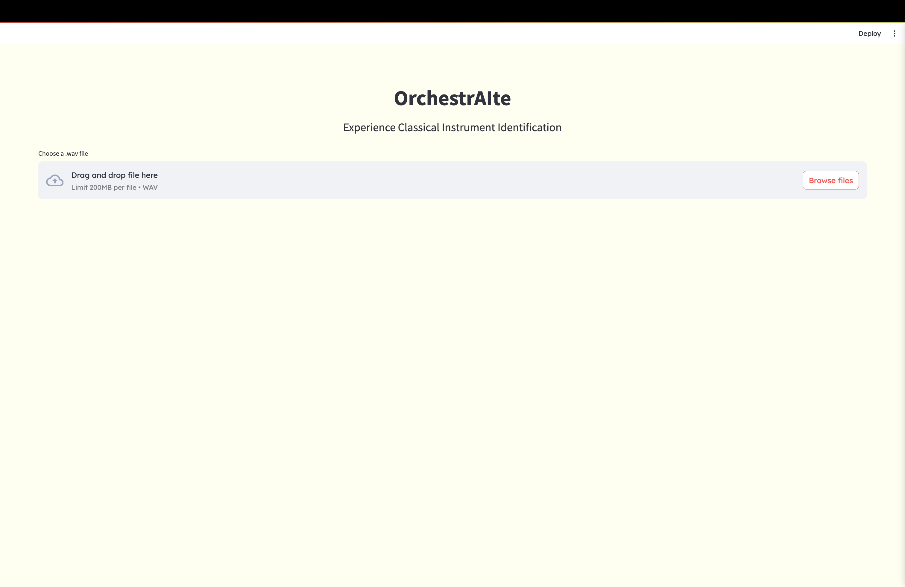
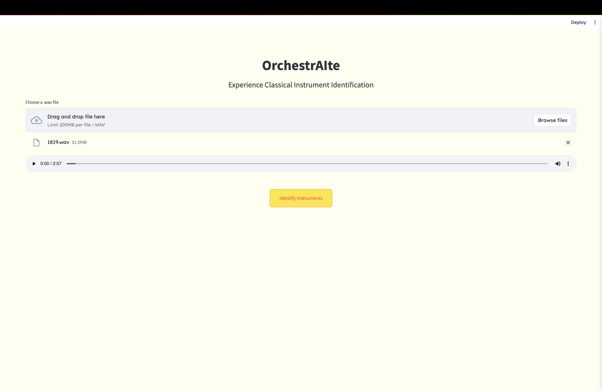
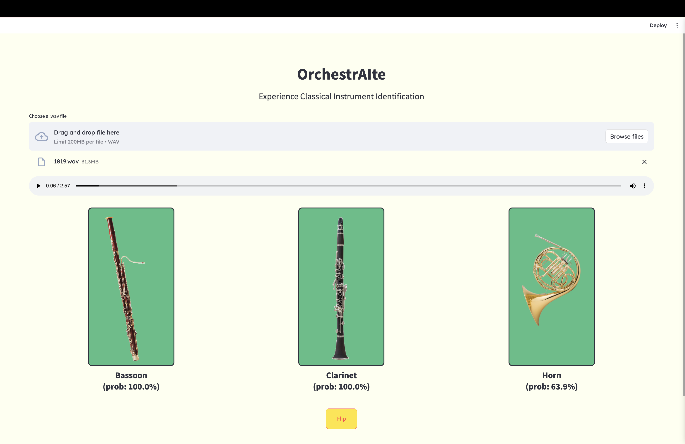
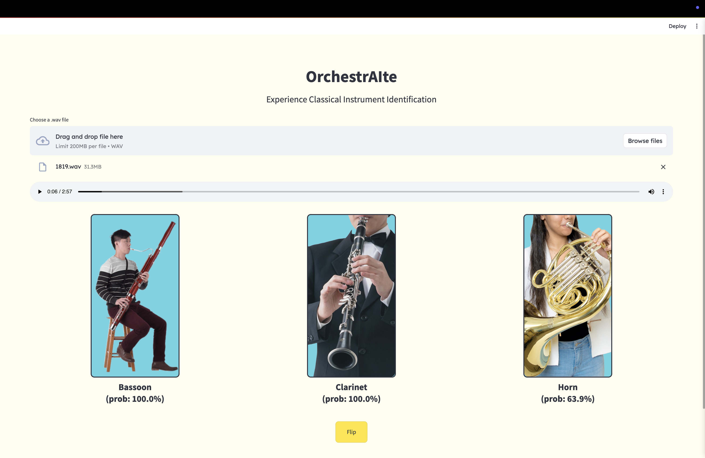

# OrchestrAIte: Instrument Classification

## Table of Contents
- [Overview](#overview)
- [Installation](#installation)
- [Usage](#usage)
- [UI Screenshots](#ui-screenshots)
- [Model and Data](#model-and-data)
- [Performance](#performance)
- [Contributors](#contributors)

## Overview

OrchestrAIte processes raw `.wav` audio input, extracts features, and predicts multiple instruments using a convolutional neural network (CNN).

### Key Features
- Accepts `.wav` audio files as input
- Uses log-mel spectrograms for feature extraction
- Multi-label CNN for instrument identification
- Web interface built with FastAPI and Streamlit
- Deployable via Docker and Google Cloud Run

## Installation

**Fork** this repository and **clone** it in your **virtual environment**.

### Install Dependencies
```sh
pip install -r requirements.txt
```

## Usage

### Run Locally (without Docker)

1. Open a terminal and start the **FastAPI** server using **Uvicorn**:
   ```sh
   uvicorn api.fast_api:app --reload
   ```
2. In a **separate terminal**, start the **Streamlit** application:
   ```sh
   streamlit run interface/app.py
   ```

### Run Locally with Docker

1. **Ensure Docker is running**, then build and start:
   ```sh
   docker compose up --build
   ```

2. Open the **Streamlit** application in your browser ➡ `http://localhost:8501`


3. To **stop and remove** containers:
   ```sh
   docker compose down
   ```

### Deploy to Google Cloud Run with Docker

1. Set up a **Google Cloud Project** and enable **Cloud Run**.
2. Authenticate with Google Cloud.
3. Build and push the Docker image to **Artifact Registry**.
4. Deploy to **Cloud Run**.
5. Update `API_URL` in `interface/app.py` with the deployed URL.
6. Test the deployment.

### Supported WAV File Format

- 32-bit PCM
- Mono
- 44.1 kHz sample rate

## UI Screenshots

User interface screenshots (click to enlarge):
<table style="border-collapse: collapse; border: none;">
  <tr>
    <td style="padding: 0;">
      <a href="ui_screenshots/screenshot-1.png">
        
      </a>
    </td>
    <td style="padding: 0;">
      <a href="ui_screenshots/screenshot-2.png">
        
      </a>
    </td>
    <td style="padding: 0;">
      <a href="ui_screenshots/screenshot-3.png">
        
      </a>
    </td>
    <td style="padding: 0;">
      <a href="ui_screenshots/screenshot-4.png">
        
      </a>
    </td>
  </tr>
</table>

<!-- 


 -->

## Model and Data

**Dataset**: The training data comes from the [MusicNet dataset on Kaggle](https://www.kaggle.com/datasets/imsparsh/musicnet-dataset), which is pre-split into training and test folders. Although MusicNet contains labels for 11 instruments in the training set, only 7 instruments are labeled in the test set. As a result, the model was trained to identify the following instruments:

1. Piano
2. Violin
3. Viola
4. Cello
5. Bassoon
6. Clarinet
7. Horn

**Preprocessing**: Exploratory data analysis, data cleaning, and feature extraction

**Model**: Custom CNN for multi-label classification

**Input**: `.wav` audio files converted into log-mel spectrograms

**Output**: Instrument identification

## Performance

The model was evaluated on the test set with the following results:

**Test Loss:** 0.08

**Test Accuracy:** 76.8%

**Precision:** 95.8%

**Recall:** 95.6%

While the model performs well on the test set, real-world performance may vary depending on the quality and complexity of the input audio.


## Contributors

OrchestrAIte was developed by a four-person team as part of a project at Le Wagon Tokyo. The project was completed in two weeks and demoed on December 6, 2024.
